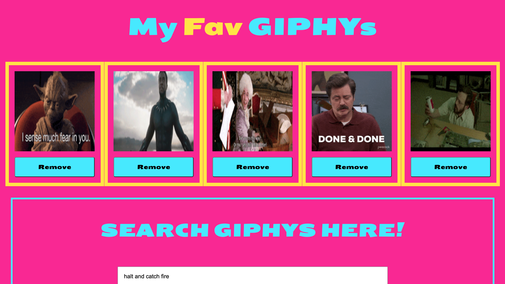

<h1 align="center">Welcome to react-giphy 👋</h1>
<a href="https://main.djscwh4p60nx1.amplifyapp.com/" target="_blank"></img></a>
<p>
  <a href="https://www.npmjs.com/package/react-giphy" target="_blank">
    
  </a>
  <a href="#" target="_blank">
    
  </a>
  <a href="https://twitter.com/duffMancode" target="_blank">
    
  </a>
</p>

> A React app to search for and collect your favorite GIPHYs.

### 🏠 [Homepage](https://main.djscwh4p60nx1.amplifyapp.com/)

### ✨ [Demo](https://main.djscwh4p60nx1.amplifyapp.com/)

## Install

```sh
npm install
```

## Usage

```sh
npm run start
```

## Run tests

```sh
npm run test
```

## Author

👤 **Brendan Duffy**

* Website: www.devduffy.com
* Twitter: [@duffMancode](https://twitter.com/duffMancode)
* Github: [@thewalkingduff](https://github.com/thewalkingduff)
* LinkedIn: [@devduffy](https://linkedin.com/in/devduffy)

## Show your support

Give a ⭐️ if this project helped you!

***
_This README was generated with ❤️ by [readme-md-generator](https://github.com/kefranabg/readme-md-generator)_# react-nasa
